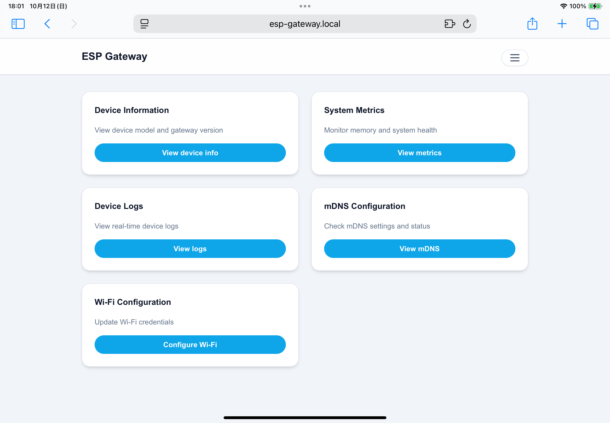
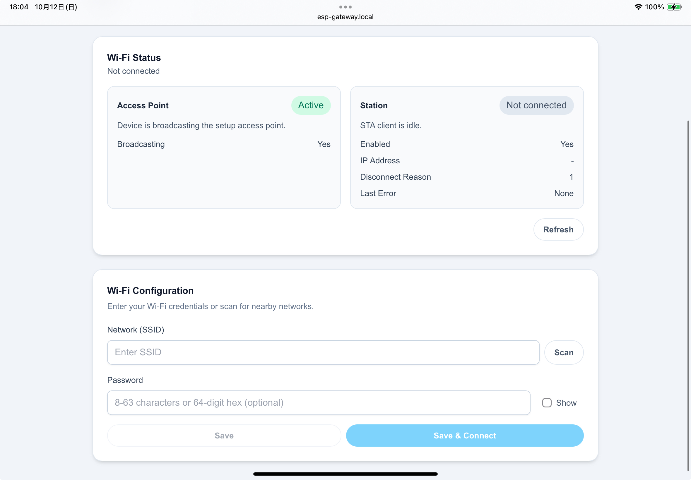

# esp-gateway

[日本語 README](README_ja.md) | [Documentation](https://earbrain.github.io/esp-gateway)

ESP-IDF library that provides both a Wi-Fi captive portal and REST APIs. The device can launch its own Wi-Fi access point and web portal so users can inspect and configure it from a browser, and it also exposes APIs for programmatic control.

<p align="center">
  
  <br>
  
</p>

## Status
- Active development. Interfaces and APIs may change without notice.

## Features
- Start a Wi-Fi access point with a captive portal
- Serve REST endpoints for device info, metrics, logs, Wi-Fi configuration, and mDNS data
- Bundle a static frontend (`portal/dist`) for an intuitive browser UI

## Requirements
- ESP-IDF with `idf.py` available
- Node.js / npm for building the portal assets

## Quick Start
```bash
cd portal
npm install
npm run build

cd ../examples
idf.py set-target esp32   # first time only
idf.py build flash monitor
```

## Example
```cpp
#include "earbrain/gateway/gateway.hpp"
#include "earbrain/logging.hpp"

extern "C" void app_main(void) {
  static const char *TAG = "my_gateway";

  earbrain::GatewayOptions opts;
  opts.ap_config.ssid = "my-device";

  earbrain::gateway().initialize(opts);
  if (earbrain::gateway().start_portal() != ESP_OK) {
    earbrain::logging::error("portal start failed", TAG);
    return;
  }

  if (earbrain::gateway().add_route("/api/custom", HTTP_GET, [](httpd_req_t *req) {
        return httpd_resp_send(req, "ok", HTTPD_RESP_USE_STRLEN);
      }) != ESP_OK) {
    earbrain::logging::error("add_route failed", TAG);
  }
}
```

See `examples/` for more usage.

## License
MIT
