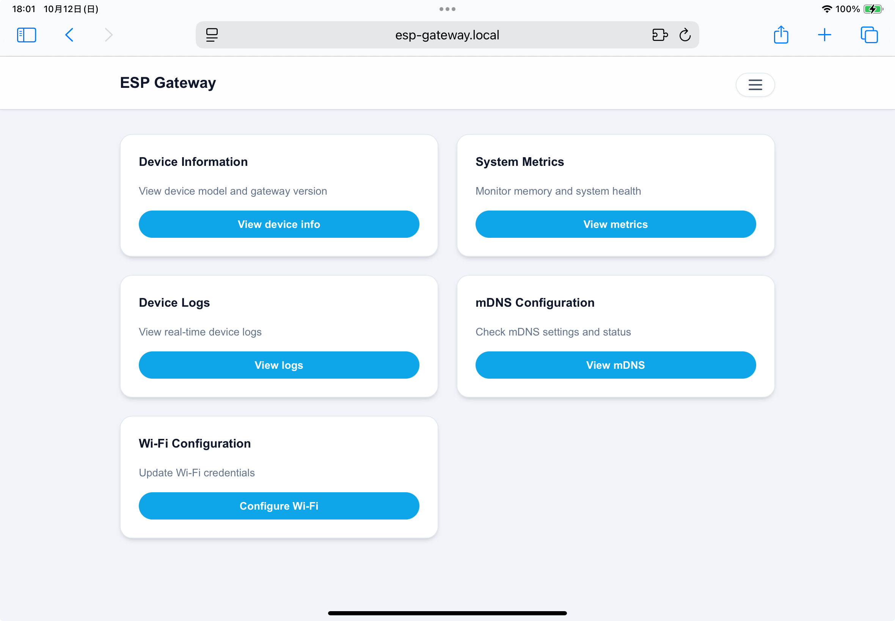
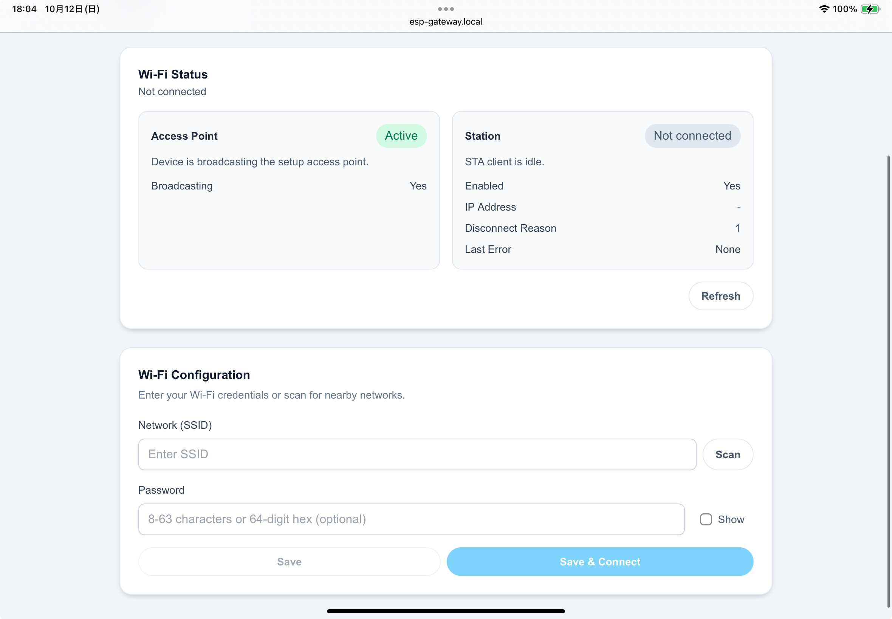

# esp-gateway

[English README](README.md) | [ドキュメント](https://earbrain.github.io/esp-gateway)

ESP-IDF 向けの Wi-Fi ポータルと REST API を提供するライブラリです。
デバイスが自前の Wi-Fi アクセスポイントと Web ポータルを立ち上げ、ブラウザ経由で状態確認・設定を行えます。
また API 経由でデバイス情報の取得や操作も実行できます。

<p align="center">
  
  <br>
  
</p>

## Status
- 現在進行中のプロジェクトです。仕様や API は今後変更される可能性があります。

## Features
- キャプティブポータル付きの Wi-Fi アクセスポイントを起動
- デバイス情報・メトリクス・ログ・Wi-Fi 設定・mDNS を扱う REST API を提供
- 静的フロントエンド（`portal/dist`）によるブラウザ UI

## Requirements
- ESP-IDF (`idf.py` が実行できること)
- Node.js / npm（UIのビルド用）

## Quick Start
```bash
cd portal
npm install
npm run build

cd ../examples
idf.py set-target esp32   # 初回のみ
idf.py build flash monitor
```

## Example
```cpp
#include "earbrain/gateway/gateway.hpp"
#include "earbrain/logging.hpp"

extern "C" void app_main(void) {
  static const char *TAG = "my_gateway";

  earbrain::GatewayOptions opts;
  opts.ap_config.ssid = "my-device";

  static earbrain::Gateway gateway(opts);
  if (gateway.start_portal() != ESP_OK) {
    earbrain::logging::error("portal start failed", TAG);
    return;
  }

  if (gateway.add_route("/api/custom", HTTP_GET, [](httpd_req_t *req) {
        return httpd_resp_send(req, "ok", HTTPD_RESP_USE_STRLEN);
      }) != ESP_OK) {
    earbrain::logging::error("add_route failed", TAG);
  }
}
```

See `examples/` for more usage.

## License
MIT
